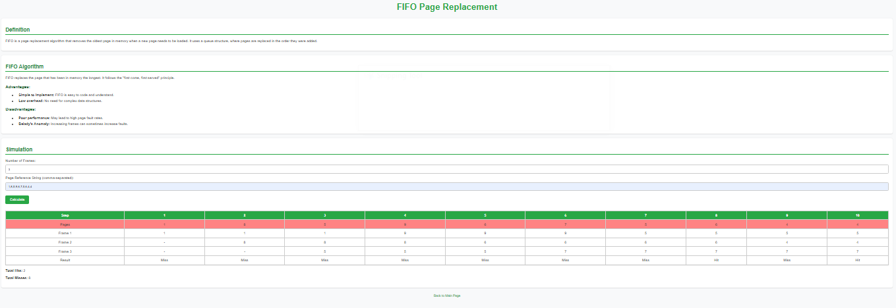
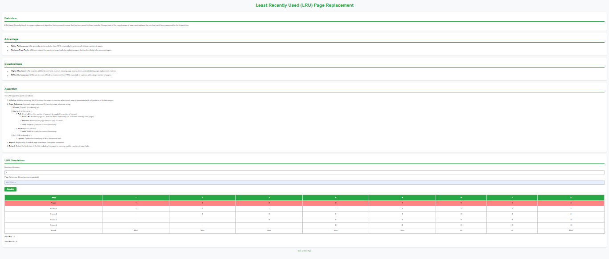
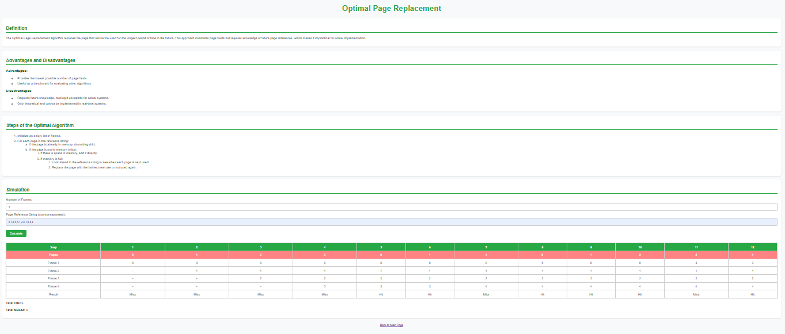
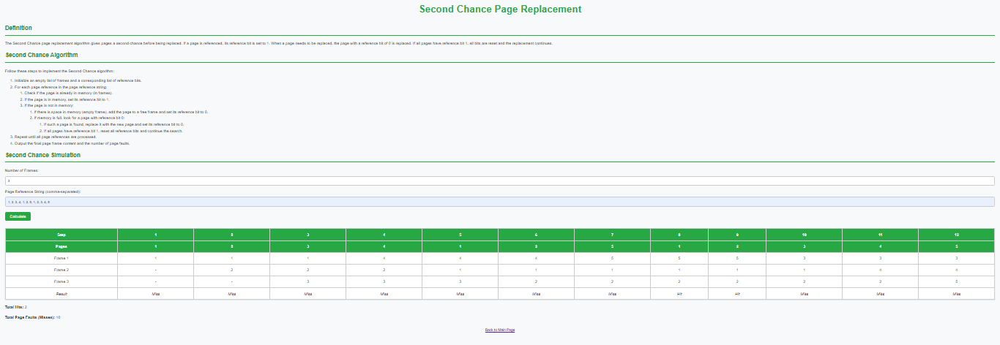
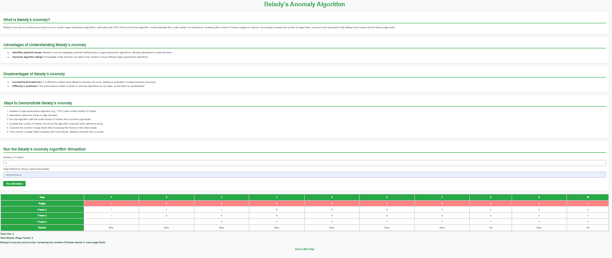

# 📄 Paging Algorithm Simulator

A visual simulator for classic **Page Replacement Algorithms** used in Operating Systems:

🔹 FIFO (First-In-First-Out)  
🔹 LRU (Least Recently Used)  
🔹 Optimal Page Replacement  
🔹 Second Chance Algorithm  
🔹 Belady’s Anomaly Visualization  

Built entirely with **HTML, CSS, and JavaScript** for easy learning, simulation, and interaction.

---

## 🚀 Live Demo

🎯 [Click here to try the simulator] (https://sanaarshad-cs.github.io/paging-simulator/)

---

## 📚 Features

- ✅ Interactive input for frames and reference string
- ✅ Clear table visualization with page hits/misses
- ✅ Total hit/miss counter at the bottom
- ✅ Each algorithm in a separate file
- ✅ Lightweight and fast — no frameworks needed
- ✅ Clean, modern UI with responsive design

---

## 📁 File Structure

| File | Description |
|------|-------------|
| `index.html` | Homepage — links to all algorithms |
| `fifo.html` | FIFO page replacement simulation |
| `lru.html` | LRU simulation |
| `optimal.html` | Optimal algorithm |
| `second-chance.html` | Second Chance algorithm |
| `belady.html` | Belady's Anomaly visualizer |
| `README.md` | Project documentation |
| `images/` | (Optional) Folder for screenshots |

---

## 📷 Screenshots

### 🔹 FIFO

### 🔹 LRU

### 🔹 Optimal

### 🔹 Second Chance

### 🔹 Belady’s Anomaly

---

## 🧠 How to Use

1. Open the [live demo](https://sanaarshad-cs.github.io/paging-simulator/) in your browser
2. Choose an algorithm from the homepage
3. Enter:
   - Number of frames
   - Page reference string (comma-separated)
4. Click **Calculate**
5. View the hit/miss result and step-by-step simulation table

---

## 👩‍💻 About the Author

Developed by **Sana Arshad**, a CS student passionate about  
**Artificial Intelligence, Full-Stack Web Development, and Problem Solving**.

- 🌐 [LinkedIn](https://linkedin.com/in/your-link) 
- 💻 [GitHub](https://github.com/sanaarshad-cs)
- 📧 sanaarshad958@email.com 

---

## 📄 License

This project is licensed under the [MIT License](LICENSE).

---

## 🌟 Star This Repo

If you found this helpful, please ⭐ star this repository and share it with others!
